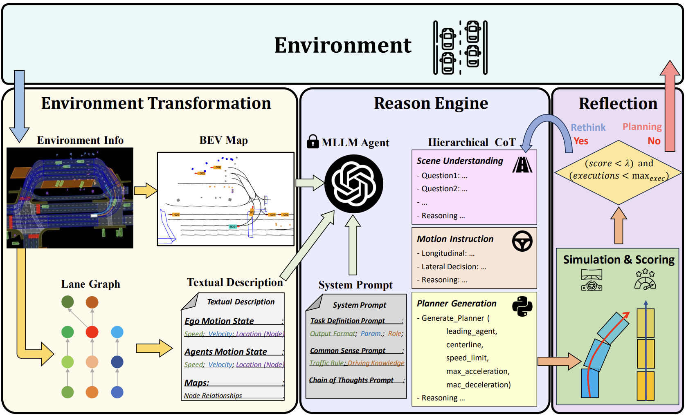

# PlanAgent: A Multi-modal Large Language Agent for Closed-loop Vehicle Motion Planning

This repository is the pytorch implementation of our paper, **PlanAgent**.

**PlanAgent: A Multi-modal Large Language Agent for Closed-loop Vehicle Motion Planning**

<div align="left">
    <a href="https://arxiv.org/pdf/2406.01587" target="_blank">
    </a>
    <a href="https://github.com/ucaszyp/PlanAgent" target="_blank">
    </a>
</div>

<a href="https://scholar.google.com/citations?user=anGhGdYAAAAJ&hl=en"><strong>Yupeng Zheng</strong></a>
·
<a href="https://scholar.google.com/citations?user=Fs9_PskAAAAJ&hl=en"><strong>Zebin Xing</strong></a>
·
<a href="https://scholar.google.com/citations?user=uUd5v2cAAAAJ&hl=en"><strong>Bu Jin</strong></a>
·
<a href="https://scholar.google.com/citations?user=snkECPAAAAAJ&hl=en"><strong>Qichao Zhang</strong></a>
·
<a href="https://philipflyg.github.io/"><strong>Pengfei Li</strong></a>
·
<a href="https://scholar.google.com/citations?user=Wn2Aic0AAAAJ&hl=en"><strong>Yuhang Zheng</strong></a>
·
<a><strong>Zhongpu Xia</strong></a>
·
<a><strong>Kun Zhan</strong></a>
·
<a><strong>XianPeng Lang</strong></a>
·
<a><strong>Yaran Chen</strong></a>
·
<a><strong>Dongbin Zhao</strong></a>
·


<b> CASIA &nbsp; | &nbsp; Li Auto  &nbsp; | &nbsp; Tsinghua University &nbsp; | &nbsp; Beihang University  &nbsp; </b>

      
_________________ 

## News

We update the latest version of our code.

## Introduction

We propose PlanAgent, the first mid-to-mid planning system based on a Multi-modal Large Language Model (MLLM). MLLM is used as a cognitive agent to introduce human-like knowledge, interpretability, and commonsense reasoning into the closed-loop planning. Specifically, PlanAgent leverages the power of MLLM through three core modules. First, an Environment Transformation module constructs a Bird’s Eye View (BEV) map and a lane-graph-based textual description from the environment as inputs. Second, a Reasoning Engine module introduces a hierarchical chain-of-thought from scene understanding to lateral and longitudinal motion instructions, culminating in planner code generation. Last, a Reflection module is integrated to simulate and evaluate the generated planner for reducing MLLM’s uncertainty. PlanAgent is endowed with the common-sense reasoning and generalization capability of MLLM, which empowers it to effectively tackle both common and complex long-tailed scenarios.
<div align=center>  </div>

## Note
This reposity will be updated soon, including:
- [x] **Initialization**.
- [x] Uploading the codes of **PlanAgent**.
- [ ] Uploading the detailed **Installation** guidelines.
- [ ] Uploading the **Training** and **Evaluation** scripts.
- [x] Uploading the **Visualization** scripts.
- [ ] Uploading the support for **Other MLLMs**.


## Getting Started

- Follow <a href="https://github.com/autonomousvision/tuplan_garage"><strong>PDM</strong></a> to prepare nuPlan dataset and simulator.

- Prepare OpenAI API


## Citation

If you find our work useful in your research, please consider citing:

```bibtex
@article{zheng2024planagent,
  title={Planagent: A multi-modal large language agent for closed-loop vehicle motion planning},
  author={Zheng, Yupeng and Xing, Zebin and Zhang, Qichao and Jin, Bu and Li, Pengfei and Zheng, Yuhang and Xia, Zhongpu and Zhan, Kun and Lang, Xianpeng and Chen, Yaran and others},
  journal={arXiv preprint arXiv:2406.01587},
  year={2024}
}
```


## Acknowledgments
Our code is built on top of open-source GitHub repositories.  We thank all the authors who made their code public, which tremendously accelerates our project progress. If you find these works helpful, please consider citing them as well.

[autonomousvision/tuplan_garage](https://github.com/autonomousvision/tuplan_garage)

[PJLab-ADG/DiLu](https://github.com/PJLab-ADG/DiLu)

[motional/nuplan-devkit](https://github.com/motional/nuplan-devkit)

[OpenGVLab/LLaMA-Adapter](https://github.com/OpenGVLab/LLaMA-Adapter)

[zai-org/CogVLM](https://github.com/zai-org/CogVLM)
